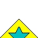
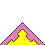
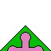
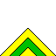

# Board

**Notice:** The board with the mandatory piece is not rotationally symetric. Therefore it is possible to determine a welldefined  coordinate system.

```

      0 1 2 3 4 5 6 7 8 9 A B C D E F

0     $ # # # # # # # # # # # # # # $
1     # . . . . . . . . . . . . . . #
2     # . ! . . . . . . . . . . ! . #
3     # . . . . . . . . . . . . . . #
4     # . . . . . . . . . . . . . . #
5     # . . . . . . . . . . . . . . #
6     # . . . . . . . . . . . . . . #
7     # . . . . . . . . . . . . . . #
8     # . . . . . . . M . . . . . . #
9     # . . . . . . . . . . . . . . #
A     # . . . . . . . . . . . . . . #
B     # . . . . . . . . . . . . . . #
C     # . . . . . . . . . . . . . . #
D     # . ! . . . . . . . . . . ! . #
E     # . . . . . . . . . . . . . . #
F     $ # # # # # # # # # # # # # # $

```

In this diagram the following symbols are used:
	-  The **$** symbol indicate a cornor piece
	-  The **#** symbol indicate a border piece
	-  The **.** symbol indicate a center piece
	-  The **M** symbol indicate the mandatory piece
	-  The **!** symbol indicate a clue piece

Coordinates should always be writen in the **yx** format in hexidecimal like: `A1, K2, BA`.
Some important coordinates are:
The mandatory piece: `88`
The clue pieces: `22, D2, 2D, DD`

# Edges
In total there are 24 distinct edges. They are listed below together with a unique name.

## Border edges
| `VOID`        | `LEATHER`  |
| --------------------------------------------- | --------------------------------------------- |
| `FLOWER`    | `BOLT`        |
| `BISQUIT`  | `STOP`        |

## Center edges
| `YELLOW_PIPES`        | `GREEN_CIRCLE`    |
| ------------------------------------------------------------- | --------------------------------------------------------- |
| `BLUE_DIAMOND`        | `BLUE_STAR`          |
| `ORANGE_DIAMOND`    | `YELLOW_STAR`      |
| `PINK_DIAMOND`        | `BLUE_CASTLE`      |
| `PURPLE_STAR`          | `YELLOW_CASTLE`  |
| `YELLOW_CIRCLE`      | `PINK_PIPES`        |
| `PINK_CIRCLE`          | `PINK_CASTLE`      |
| `GREEN_RECTANGLE`  | `ORANGE_PIPES`    |
| `BLUE_RECTANGLE`    |                                                           |

## Edge indexes
```
(index 0 is unspecified)
VOID            = 01 
BISQUIT         = 02 
BLUE_CASTLE     = 03 
BLUE_DIAMOND    = 04 
BLUE_RECTANGLE  = 05 
BLUE_STAR       = 06 
BOLT            = 07 
FLOWER          = 08 
GREEN_CIRCLE    = 09 
GREEN_RECTANGLE = 10 
LEATHER         = 11 
ORANGE_DIAMOND  = 12 
ORANGE_PIPES    = 13 
PINK_CASTLE     = 14 
PINK_CIRCLE     = 15 
PINK_DIAMOND    = 16 
PINK_PIPES      = 17 
PURPLE_STAR     = 18 
STOP            = 19 
YELLOW_PIPES    = 20 
YELLOW_CASTLE   = 21 
YELLOW_CIRCLE   = 22 
YELLOW_STAR     = 23 
```

# Mandatory piece
At the coordinate `0x88` the follwing piece is mandatory: `( top BLUE_STAR right YELLOW_CIRCLE bottom YELLOW_CIRCLE left ORANGE_DIAMOND )`

# Clue pieces
`0x22` is given as `( top PINK_CIRCLE right GREEN_CIRCLE bottom ORANGE_DIAMOND left YELLOW_STAR )`
`0x2D` is given as `( top PINK_CIRCLE right PURPLE_STAR bottom PINK_CIRCLE left BLUE_RECTANGLE )`
`0xD2` is given as `( top BLUE_RECTANGLE right YELLOW_CIRCLE bottom YELLOW_CASTLE left ORANGE_DIAMOND )`
`0xDD` is given as `( top PINK_DIAMOND right YELLOW_CASTLE bottom GREEN_RECTANGLE left BLUE_CASTLE )`

# Super pieces formats

## Filename
A super pieces file should be named after the positions of the pieces it represents. Like:
`A1A2` `F3F4` `B3`
The positions should be ordered the order of the hexdecimal values the positions represent. No file extension is given.

## Format indicator
The first line of the file should always contain the format like:
``<format>`` where `<format>` should be replaced by the used format.

**Notice:** A single piece is identified by its edges which is possible by property **~xxx~**.

## Formats

### Base piece format
``base_piece_format``
Each piece is stored as: 
```
( top <edge_name> right <edge_name> bottom <edge_name> left <edge_name> )
```
Each `<edge_name>` should be replaced by the edge name as given in **~xxx~**
Each piece represents all rotations, so to get the full set, all possible rotations should read.

**Restriction:** Only supports one dimensional super pieces
 
### Complete bit format
``complete_bit_f1``
Every piece is stored as a 32-bit integer. 

`<kind><rotation><piece_id><left_edge><bottom_edge><right_edge><top_edge>`
TOP_BIT         = 0;
RIGHT_BIT       = 5;
BOTTOM_BIT      = 10;
LEFT_BIT        = 15;
ID_BIT          = 20;
ROTATION_BIT    = 28;
KIND_BIT        = 30


